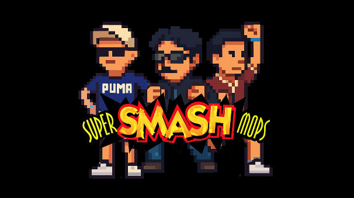

# Super Smash Mops



Un juego de pelea inspirado en el estilo de *Super Smash Bros* desarrollado en **Godot Engine**. El proyecto se encuentra en progreso y actualmente ofrece un modo multijugador local para dos jugadores.

---

## ¿De qué trata el proyecto?

*Super Smash Mops* es un **juego de lucha en 2D** donde los jugadores seleccionan un personaje y compiten en escenarios (compuestos por plataformas) con la meta de reducir las vidas del oponente. Cada jugador cuenta con ataques únicos, posibilidad de realizar saltos dobles y de utilizar ataques aéreos. El objetivo es derribar al oponente tres veces antes de que él lo haga contigo.

Aunque está inspirado en *Super Smash Bros*, este proyecto cuenta con personajes y escenarios propios, creados específicamente para esta versión estudiantil.

---

## Requisitos previos

Para ejecutar el proyecto necesitas:

* **Godot Engine 4.x** instalado en tu computadora (descarga gratuita en [godotengine.org](https://godotengine.org/)).
* **Git** para clonar el repositorio.
* Un sistema operativo compatible con Godot (Windows, Linux o macOS).

---

## Instalación y ejecución

Para clonar y ejecutar el proyecto en tu computadora:

```bash
# Clonar el repositorio
git clone https://github.com/Bfdiego/Super_Smash_Mops.git

# Entrar al directorio del proyecto
cd Super_Smash_Mops

# Abrir el proyecto en Godot

# Desde Godot, selecciona "Import" y elige el archivo llamado "Super_Smash_Mops"
```

---

## Assets y recursos

### Recursos visuales

Todos los assets del proyecto (sprites, imágenes y recursos gráficos) fueron **generados con inteligencia artificial (IA)**. Esto permite que cualquiera pueda replicar el proceso para crear sus propios recursos personalizados utilizando herramientas de generación de imágenes por IA.

### Recursos de audio

Los sonidos y música fueron obtenidos de bancos gratuitos y ajustados para su uso en el juego. Estos **efectos de sonido y música** se obtuvieron de la página [KHInsider Game Soundtracks](https://downloads.khinsider.com/game-soundtracks/album/super-smash-bros-brawl-gamerip).  

Además, el juego incluye una **voz generada con inteligencia artificial**, utilizada para darle más personalidad a la experiencia.

---

## Características principales

* **Selector de personajes:** actualmente se pueden elegir entre **Agui**, **Diego** y **Mazen**. También existe la opción de selección aleatoria.
* **Modos de juego:**

  * **Un jugador** *(en desarrollo, aún no disponible)*.

  * **Multijugador local** (2 jugadores en la misma PC).
* **Selector de escenario:** dos mapas disponibles (Campus y Postgraduate).
* **Sistema de vidas:** cada jugador comienza con 3 vidas. Cuando pierde todas, se muestra una pantalla de victoria.
* **Contadores visuales:** corazones para representar las vidas y avatares de los personajes seleccionados.
* **Ataques diferenciados:** cada personaje cuenta con al menos 3 tipos de ataque, incluyendo ataques aéreos.

---

## Controles

### Player 1

* **Mover a la izquierda:** `A`
* **Mover a la derecha:** `D`
* **Saltar (doble salto disponible):** `W`
* **Ataque 1:** `C`
* **Ataque 2:** `V`
* **Ataque aéreo:** `V` o `C` mientras está en el aire

### Player 2

* **Mover a la izquierda:** `←`
* **Mover a la derecha:** `→`
* **Saltar (doble salto disponible):** `↑`
* **Ataque 1:** `P`
* **Ataque 2:** `O`
* **Ataque aéreo:** `P` o `O` mientras está en el aire

---

## Estado del proyecto y próximas mejoras

Actualmente, el proyecto se encuentra en una fase **jugable en modo multijugador local (2 jugadores en la misma PC)**. Esto significa que, aunque ya se puede disfrutar de combates completos, aún existen varias características en desarrollo que enriquecerán la experiencia.

### Próximas mejoras y objetivos:

* **Modo de un jugador:** implementación de una IA básica que permita enfrentarse a la computadora.  
* **Nuevos personajes:** incorporación de más luchadores, cada uno con **ataques y estilos únicos**.  
* **Ampliación de escenarios:** nuevos mapas jugables, además de mejoras visuales y mayor interacción con el entorno.
* **Mejoras de audio y efectos:** más efectos de sonido y variaciones en la voz generada por IA.  

El objetivo es continuar expandiendo el proyecto de manera iterativa, manteniendo la esencia del género *platform fighter* y explorando nuevas ideas creativas.

---

## Licencia

Este proyecto es de código abierto. Puedes revisarlo, modificarlo y contribuir en el repositorio oficial:
👉 [Super\_Smash\_Mops en GitHub](https://github.com/Bfdiego/Super_Smash_Mops.git)

---

## Autores del proyecto

* Diego Alba
* Joaquin Augilera
* Mazen Abu Hamdan
